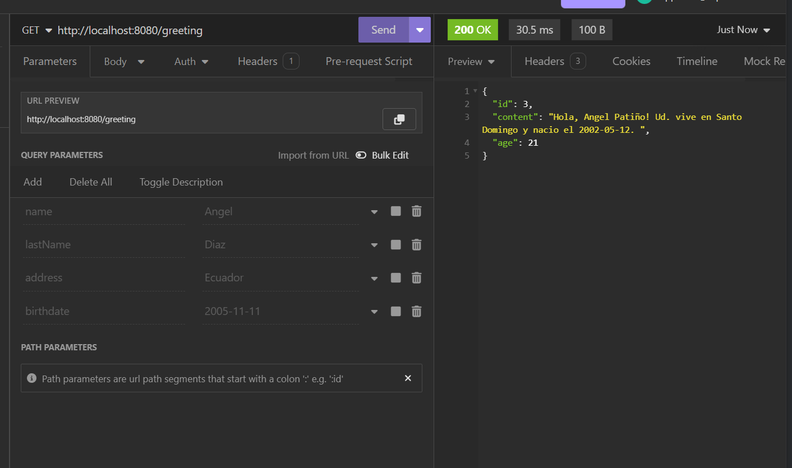
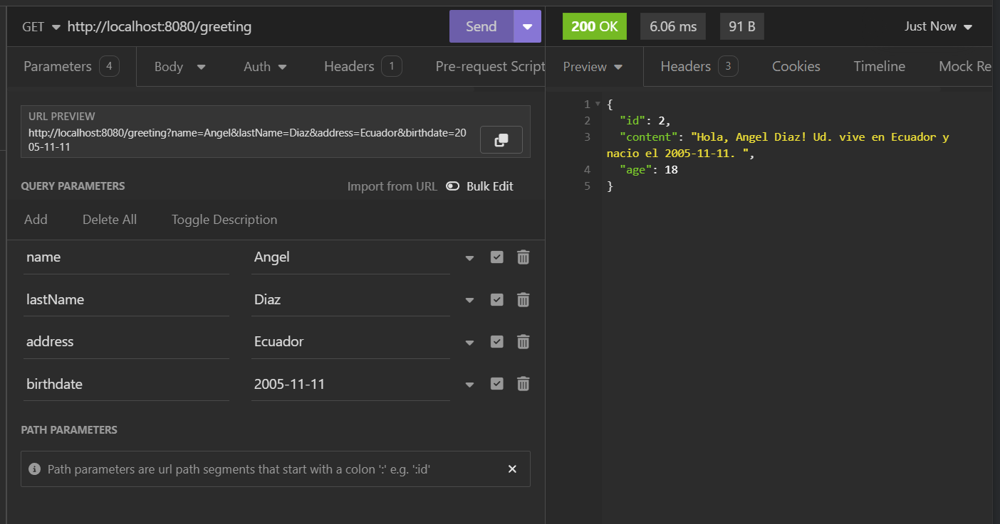

# Saludo en Spring Boot

Esta es una aplicación simple de Spring Boot que proporciona una API RESTful para saludar a los usuarios.

## **Select Language:**
- [Español (Spanish)](README-es.md)
- [English](README.md)

## Result
### Default Greeting

### Custom Greeting


## Dependencias

Este proyecto está construido usando Maven y depende de las siguientes dependencias:

- **Spring Boot Starter Web**: Proporciona todas las dependencias necesarias para configurar una aplicación Spring MVC, incluido el servidor Tomcat integrado.
- **Spring Boot Starter Test**: Incluye dependencias para probar aplicaciones Spring Boot.

## Requisitos

- Kit de Desarrollo de Java (JDK) 17
- Apache Maven

## Construcción y Ejecución de la Aplicación

Para construir y ejecutar la aplicación localmente, sigue estos pasos:

1. Clona el repositorio:

```bash
git clone https://github.com/Anyel-ec/Spring-Boot-Introduce-HelloWord
```

2. Navega al directorio del proyecto:

```bash
cd Spring-Boot-Introduce-HelloWord
```

3. Construye el proyecto usando Maven:

```bash
mvn clean package
```

4. Ejecuta la aplicación:

```bash
java -jar target/Hola-0.0.1-SNAPSHOT.jar
```

La aplicación se iniciará en el puerto 8080 por defecto.

## Uso

Una vez que la aplicación esté en ejecución, puedes acceder al punto final de saludo usando tu navegador web o una herramienta como cURL:

```bash
curl http://localhost:8080/greeting
```
o
```bash
curl http://localhost:8080/greeting?name=Anyel&lastName=Pati%C3%B1o&address=Santo+Domingo&birthdate=2002-05-12
```

Esto devolverá un saludo personalizado. También puedes especificar parámetros adicionales como `name`, `lastName`, `address` y `birthdate` para personalizar aún más el saludo.