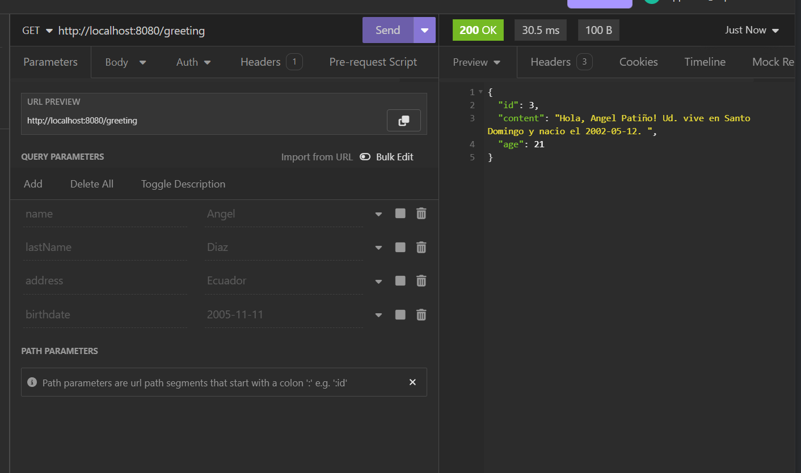
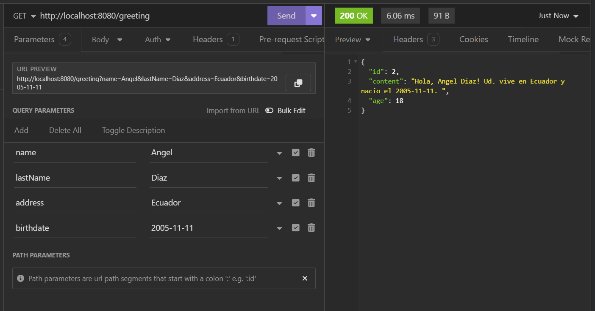

# Greeting in Spring Boot

This is a simple Spring Boot application that provides a RESTful API to greet users.

## **Select Language:**
- [Español (Spanish)](README-es.md)
- [English](README.md)

## Result
### Default Greeting

### Custom Greeting


## Dependencies

This project is built using Maven and depends on the following dependencies:

- **Spring Boot Starter Web**: Provides all the necessary dependencies to set up a Spring MVC application, including embedded Tomcat server.
- **Spring Boot Starter Test**: Includes dependencies for testing Spring Boot applications.

## Requirements

- Java Development Kit (JDK) 17
- Apache Maven

## Building and Running the Application

To build and run the application locally, follow these steps:

1. Clone the repository:

```bash
git clone https://github.com/Anyel-ec/Spring-Boot-Introduce-HelloWord
```

2. Navigate to the project directory:

```bash
cd Spring-Boot-Introduce-HelloWord
```

3. Build the project using Maven:

```bash
mvn clean package
```

4. Run the application:

```bash
java -jar target/Hola-0.0.1-SNAPSHOT.jar
```

The application will start on port 8080 by default.

## Usage

Once the application is running, you can access the greeting endpoint using your web browser or a tool like cURL:

```bash
curl http://localhost:8080/greeting
```
or 
```bash
    curl http://localhost:8080/greeting?name=Anyel&lastName=Pati%C3%B1o&address=Santo+Domingo&birthdate=2002-05-12
```
This will return a personalized greeting. You can also specify additional parameters like `name`, `lastName`, `address`, and `birthdate` to customize the greeting further.


